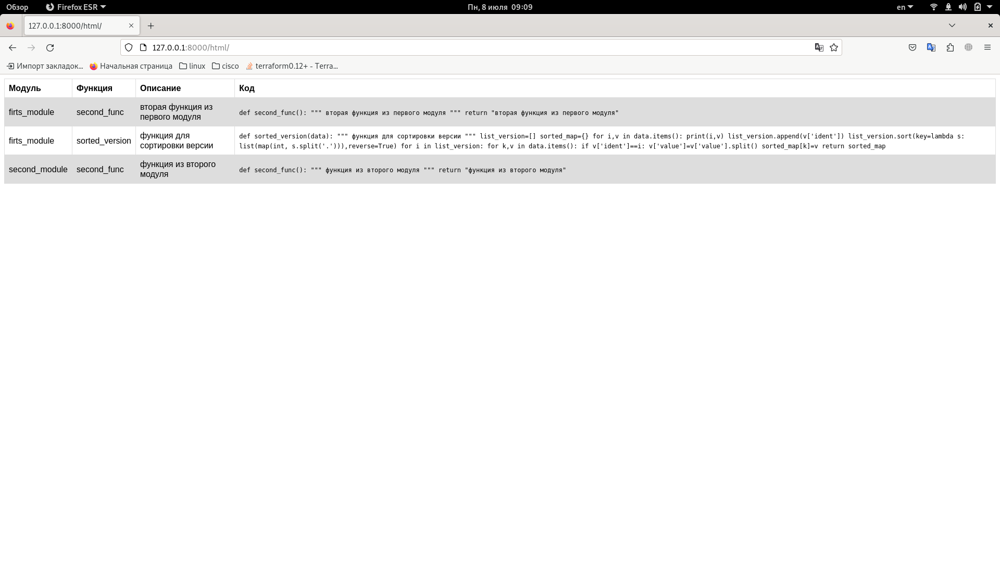

### Тестовое задание

#### Запуск сервера
```
~/mysite$ python manage.py runserver
Watching for file changes with StatReloader
Performing system checks...

System check identified no issues (0 silenced).

You have 18 unapplied migration(s). Your project may not work properly until you apply the migrations for app(s): admin, auth, contenttypes, sessions.
Run 'python manage.py migrate' to apply them.
July 08, 2024 - 04:08:10
Django version 5.0.6, using settings 'mysite.settings'
Starting development server at http://127.0.0.1:8000/
Quit the server with CONTROL-C.

```

#### Проверка пути /html/



#### Проверка работы клиента с правльным путем

```
$ python client.py 
{"ERROR number 3": {"ident": "2.5", "value": ["Boo", "Boo", "Boo"]}, "ERROR number 1": {"ident": "2.1.11", "value": ["test", "test"]}, "ERROR number 2": {"ident": "2.1.2", "value": ["bla", "bla"]}}
```
#### Проверка работы клиента с неправльными путями

```
$ python client.py 
Unknown module NAME
```

```
$ python client.py 
Unknown function NAME
```
